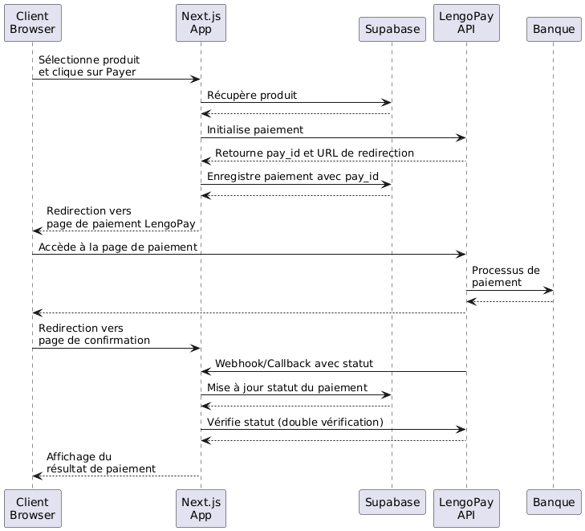

# LengoPay Demo

Application de démonstration pour l'intégration de l'API de paiement LengoPay avec Next.js et Supabase.

## Démo Vidéo

[](https://youtube.com/votre-lien-a-venir)

> 
> La vidéo couvre:
> - Installation et configuration
> - Démonstration du processus de paiement
> - Explication de l'intégration avec Supabase
> - Gestion des callbacks sécurisés

## Technologies

- Next.js 15.3.0 (App Router)
- Supabase
- TypeScript
- Tailwind CSS

## Installation

1. **Cloner le projet et installer les dépendances**
   ```bash
   npm install
   ```

2. **Configurer les variables d'environnement**
   Créez un fichier `.env.local` :
   ```
   # LengoPay API
   LENGOPAY_LICENSE_KEY=votre_license_key
   LENGOPAY_WEBSITE_ID=votre_website_id
   NEXT_PUBLIC_BASE_URL=http://localhost:3000

   # Supabase
   NEXT_PUBLIC_SUPABASE_URL=votre_url_supabase
   NEXT_PUBLIC_SUPABASE_ANON_KEY=votre_clé_supabase
   ```

3. **Configurer Supabase**

   > ⚠️ **Sécurité importante**: Par défaut, les tables Supabase sont publiques sans RLS. Assurez-vous d'activer Row Level Security.
   >
   > ℹ️ **Note pour la démo**: Cette configuration utilise des politiques RLS permissives pour simplifier le développement. Dans un environnement de production, utilisez des règles plus restrictives.

   ```sql
   -- Table des produits
   CREATE TABLE products (
     id UUID PRIMARY KEY DEFAULT uuid_generate_v4(),
     name VARCHAR(255) NOT NULL,
     price INTEGER NOT NULL,
     currency VARCHAR(3) NOT NULL,
     description TEXT,
     image VARCHAR(255),
     created_at TIMESTAMP WITH TIME ZONE DEFAULT NOW()
   );

   -- Table des paiements
   CREATE TABLE payments (
     id UUID PRIMARY KEY DEFAULT uuid_generate_v4(),
     product_id UUID REFERENCES products(id),
     pay_id VARCHAR(255) UNIQUE NOT NULL,
     amount INTEGER NOT NULL,
     currency VARCHAR(3) NOT NULL,
     status VARCHAR(20) NOT NULL,
     message TEXT,
     metadata JSONB,
     created_at TIMESTAMP WITH TIME ZONE DEFAULT NOW(),
     updated_at TIMESTAMP WITH TIME ZONE DEFAULT NOW()
   );
   
   -- Activer Row Level Security (RLS)
   ALTER TABLE products ENABLE ROW LEVEL SECURITY;
   ALTER TABLE payments ENABLE ROW LEVEL SECURITY;
   
   -- Créer des politiques d'accès (simplifiées pour la démo)
   -- Politique pour products - autoriser toutes les opérations
   CREATE POLICY "products_all_operations_policy" ON products
     FOR ALL USING (true) WITH CHECK (true);
   
   -- Politique pour payments - autoriser toutes les opérations
   CREATE POLICY "payments_all_operations_policy" ON payments
     FOR ALL USING (true) WITH CHECK (true);
   ```

4. **Initialiser la base de données**
   ```bash
   npm run init-products
   ```

5. **Configuration pour les callbacks HTTPS**
   ```bash
   ngrok http 3000
   ```
   
   > LengoPay exige des callbacks HTTPS. ngrok crée un tunnel sécurisé vers votre serveur local.
   
   Mettez à jour `.env.local` avec l'URL ngrok :
   ```
   NEXT_PUBLIC_BASE_URL=https://votre-url-ngrok.io
   ```
   
   Ajoutez l'URL ngrok dans `next.config.mjs` :
   ```javascript
   allowedDevOrigins: ['votre-url-ngrok.io'],
   ```

6. **Démarrer le serveur**
   ```bash
   npm run dev
   ```

## Workflow de paiement



## API Endpoints

- **POST /api/lengopay/initialize** - Initialise un paiement
- **GET /api/lengopay/status/[pay_id]** - Vérifie le statut
- **POST /api/lengopay/callback** - Reçoit les callbacks
- **GET /api/lengopay/latest** - Récupère le dernier paiement
